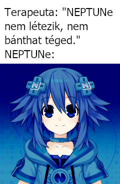

- [HU](README.hu.md)
- [EN](README.en.md)

## 
Neptune - A theme engine for the Neptun webpage

****
Most of the Hungarian middle school heared about the Neptun Education System and it's website (that we just cal Neptun). They've heared about it not because it is with out flaws. This repository was not made so that we can bad mouth the system or reveale it's technical details.

Neptune is a theme engine for the Neptun webpage. Nowadays theme engines are not so common as they used to be so there is some explanation: a theme engine wil not do anything with your password, does not care about your username, it will not do anything harmful, it'll simply change the looks of the website.
****

Neptune is a User script that gives a fresh look for the Neptun website! Did you ever want to use the website with a My little Pony theme? Or would you reather want to be greeted by the [Mézga Family](https://en.wikipedia.org/wiki/The_M%C3%A9zga_Family)? With us, you can do all of these!

We are tring to create simple and modular themes so anyone could create ther own, and create the comfort of home!

But Neptune is not just that: it's a perfect partner in crime with [Neptun PowerUp-nak!](https://github.com/solymosi/npu) It does not just add theme switching but adds some fixing so that creating themes and switching between them is as smooth as possible. Such change is the theme switching buttons: now you can choose your theme froma dropdown menu!

### Alreday created and planned themes

- Hyperdimension Neptunia AKA Neptune (✔): the theme that we named our engine after. Our first completed theme.
- Menhera-chan (🔨)
- Yotsuba (✔)
- My Littel Pony (🚧)
- Satania (🚧)
- Windows XP (🚧)
- Mézga Kriszta / Mézga Family (🚧)
- Pink panther (🔨)
- Stallman (🚧)
- Lain (🚧)
- Taiga (🚧)
- One Punch Man (🚧)
- Tohru (🚧)

### Why Neptune?

Around 2019 okt. 17. on a facebook group called S-Oszkár a meme appeared:  
**captions:**  
**Therapist: "NEPTUNe does not exist, she can't hurt you."**  
**NEPTUNe: \*exists\***  

Based on this one of my friends made a Neptune header for Neptun, thus the story begun.  
Continuing my friend's dea I started to make a theme based on the header. To make the theme making and switching possible I made some patches to the sites javascript. That is the base of our engine.

After this the theme ideas came one after another.

### What can Neptune do?

Some picture for example:  

