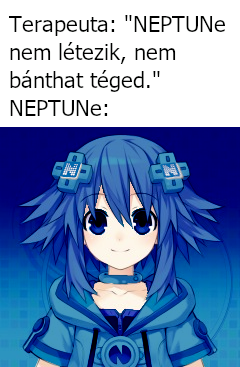
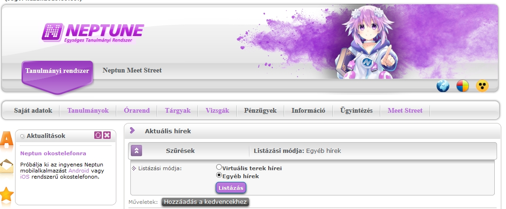
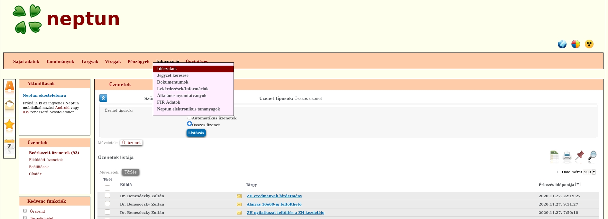

# README

- [HU](#hun-neptune)
- [EN](#en-neptune)

## 
Neptune - Egy téma motor a Neptun weboldalhoz

****
Szerintem középiskola óta hallhatjuk a rém meséket a Neptun rendszeréről. Ez a repo nem azért jött létre, hogy ezt a témát kivesézzük, és nem is arra, hogy aki rátalál, ellene uszítsa.

A Neptune az a Neptun rendszerhez íródot téma motor. Ritkán hallani manapság ezt szókapcsolatot, egy kis magyarázatot fűznék hozzá: a téma motorok nem tesznek semmi kártékonyat, nem nézik a jelszavaidat, felhasználó nevedet, szimplán az adott weboldal kinézetét változtatják meg.
****

Neptune az egy User script, ami felfrissíti a Neptunod kinézetét! Akartál valaha My Little Pony-s Neptunt? Vagy talán a Mézga családdal szembe találni magad minden bejelentkezéskor? Velünk ezt mind megteheted!

Próbálunk minél egyszerűbb és modurálisabb témákat írni, hogy bárki képes legyen saját, egyedi témákat létrehozni, így teremtve meg az otthonosság érzetét.

Ám a Neptune nem csak ennyiből áll: Tökéletes társa a [Neptun PowerUp-nak!](https://github.com/solymosi/npu) A mellett, hogy témát változtathatsz pár kisebb javítást is eszközöl, ami miatt sokkal simább émény fogad a honlapon. Ilyen változtatás például a téma választó, ahol most már legördülő menüből választhatod ki témáidat.

### Tervezett témáink és elkészült témáink

- Hyperdimension Neptunia AKA Neptune (✔): a motorunk becenevét adó téma. Az első elkészült témánk.
- Menhera-chan (🔨)
- Yotsuba (✔)
- My Littel Pony (🚧)
- Satania (🚧)
- Windows XP (🚧)
- Mézga Kriszta / Mézga Család (🚧)
- Rózsaszín párduc (🔨)
- Stallman (🚧)
- Lain (🚧)
- Taiga (🚧)
- One Punch Man (🚧)
- Tohru (🚧)

### Ötletek, jövőbeli elképzelések

- Bejelentkezési lap téma.
- Beállítások
- Más téma források
- Világ uralom

### Miért pont Neptune?

Nagyjából 2019 okt. 17. körül az S-Oszkár nevű facebook csoportban megjelent az alábbi meme:  

Ez alapján jött ismerősöm ötlete, hogy csináljuk meg a Neptun honlapját egy neptune-s fejléccel.  
Én ezt az ötletet tovább fejlesztve elkezdtem egy tényleges témát írni, belevájni magamat a témába. Pár javítást kellet eszközölnöm, hogy gond nélkül tudjam alkalmazni a témákat, így született meg a motor alapja.

Ezek után csak jöttek a téma ötletek.

### Még is mire is képes?

Itt van pár példa:  

## 
Neptune - A theme engine for the Neptun webpage

****
Most of the Hungarian middle school heared about the Neptun Education System and it's website (that we just cal Neptun). They've heared about it not because it is with out flaws. This repository was not made so that we can bad mouth the system or reveale it's technical details.

Neptune is a theme engine for the Neptun webpage. Nowadays theme engines are not so common as they used to be so there is some explanation: a theme engine wil not do anything with your password, does not care about your username, it will not do anything harmful, it'll simply change the looks of the website.
****

Neptune is a User script that gives a fresh look for the Neptun website! Did you ever want to use the website with a My little Pony theme? Or would you reather want to be greeted by the [Mézga Family](https://en.wikipedia.org/wiki/The_M%C3%A9zga_Family)? With us, you can do all of these!

We are tring to create simple and modular themes so anyone could create ther own, and create the comfort of home!

But Neptune is not just that: it's a perfect partner in crime with [Neptun PowerUp-nak!](https://github.com/solymosi/npu) It does not just add theme switching but adds some fixing so that creating themes and switching between them is as smooth as possible. Such change is the theme switching buttons: now you can choose your theme froma dropdown menu!

### Alreday created and planned themes

- Hyperdimension Neptunia AKA Neptune (✔): the theme that we named our engine after. Our first completed theme.
- Menhera-chan (🔨)
- Yotsuba (✔)
- My Littel Pony (🚧)
- Satania (🚧)
- Windows XP (🚧)
- Mézga Kriszta / Mézga Family (🚧)
- Pink panther (🔨)
- Stallman (🚧)
- Lain (🚧)
- Taiga (🚧)
- One Punch Man (🚧)
- Tohru (🚧)

### Why Neptune?

Around 2019 okt. 17. on a facebook group called S-Oszkár a meme appeared:  
**captions:**  
**Therapist: "NEPTUNe does not exist, she can't hurt you."**  
**NEPTUNe: \*exists\***  

Based on this one of my friends made a Neptune header for Neptun, thus the story begun.  
Continuing my friend's dea I started to make a theme based on the header. To make the theme making and switching possible I made some patches to the sites javascript. That is the base of our engine.

After this the theme ideas came one after another.

### What can Neptune do?

Some picture for example:  

